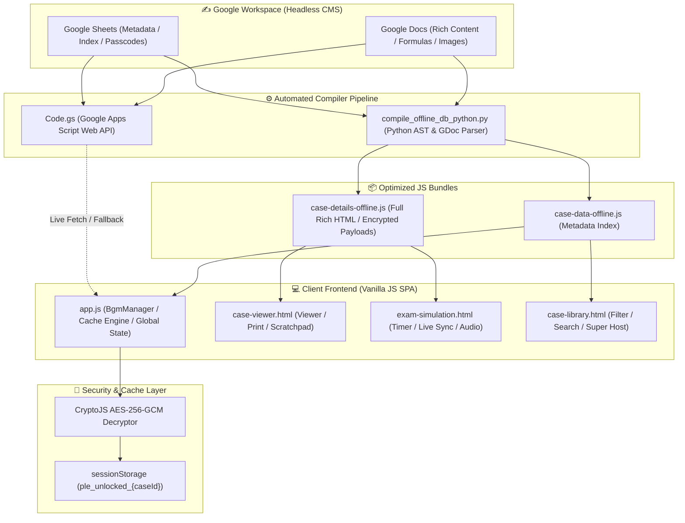
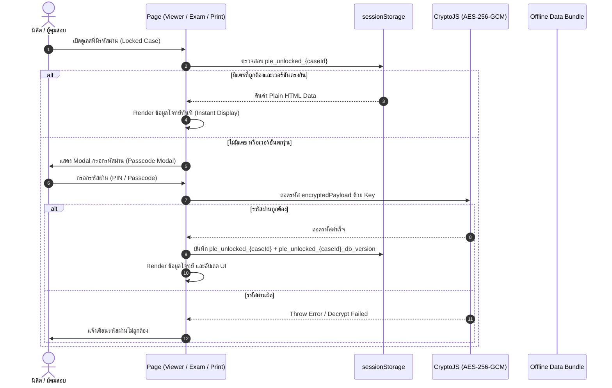

# 💊 PLE-CC Practice Platform — RxCU Exam Preparation System
> **ระบบคลังข้อสอบและจำลองห้องสอบใบประกอบวิชาชีพเภสัชกรรม (PLE-CC1 & PLE-CC2)**  
> **คณะเภสัชศาสตร์ จุฬาลงกรณ์มหาวิทยาลัย (RxCU84 & RxCU85)**  
> **Repository:** [PLE-CC-Practice-Web-Page](https://github.com/thanadolnar-png/PLE-CC-Practice-Web-Page.git)  
> **ผู้ดูแลโครงการ (Project Chair):** ธนดล (Maxnum) | นิสิตเภสัชศาสตร์ จุฬาฯ ปี 5 (RxCU84/85)  
> **พิมพ์เขียวสถาปัตยกรรมระดับละเอียด (440+ Functions Blueprint):** [`SYSTEM_ARCHITECTURE_MASTER_GUIDE.md`](./SYSTEM_ARCHITECTURE_MASTER_GUIDE.md)

---

## 📑 สารบัญ (Table of Contents)
1. [บทนำและที่มาของโครงการ (Introduction & Background)](#1-บทนำและที่มาของโครงการ-introduction--background)
2. [สถาปัตยกรรมระบบและ Data Flow Diagrams](#2-สถาปัตยกรรมระบบและ-data-flow-diagrams)
3. [โครงสร้างแฟ้มข้อมูลและไฟล์ (Project File Structure)](#3-โครงสร้างแฟ้มข้อมูลและไฟล์-project-file-structure)
4. [รายละเอียดการทำงานของแต่ละหน้าเว็บ (Page Specifications)](#4-รายละเอียดการทำงานของแต่ละหน้าเว็บ-page-specifications)
5. [ระบบวิศวกรรมและฟีเจอร์เด่น (Core Engineering Breakthroughs)](#5-ระบบวิศวกรรมและฟีเจอร์เด่น-core-engineering-breakthroughs)
   - 5.1 [ระบบประมวลผลสมการ ตัวห้อย/ตัวยก และช่องว่าง (Equations, Subscripts & Formatting)](#51-ระบบประมวลผลสมการ-ตัวห้อยตัวยก-และช่องว่าง-equations-subscripts--formatting)
   - 5.2 [ระบบความปลอดภัยและถอดรหัสเคสลับ (AES-256-GCM & Decryption Cache)](#52-ระบบความปลอดภัยและถอดรหัสเคสลับ-aes-256-gcm--decryption-cache)
   - 5.3 [ระบบเครื่องพิมพ์ข้อสอบเดี่ยวและชุด (Single & Batch Print Engine)](#53-ระบบเครื่องพิมพ์ข้อสอบเดี่ยวและชุด-single--batch-print-engine)
   - 5.4 [ระบบจำลองสอบ OSPE และ Live Examinee Answer Sync](#54-ระบบจำลองสอบ-ospe-และ-live-examinee-answer-sync)
   - 5.5 [ระบบเสียงประกอบและ BGM Manager](#55-ระบบเสียงประกอบและ-bgm-manager)
6. [ระบบฐานข้อมูลและ Data Pipeline (Database & Auto-Compilation)](#6-ระบบฐานข้อมูลและ-data-pipeline-database--auto-compilation)
7. [ดัชนีฟังก์ชันและ Master Guide Reference](#7-ดัชนีฟังก์ชันและ-master-guide-reference)
8. [คู่มือการส่งต่องานและการบำรุงรักษา (Handover & Maintenance Guide)](#8-คู่มือการส่งต่องานและการบำรุงรักษา-handover--maintenance-guide)
9. [กฎระเบียบและข้อควรระวังสำคัญ (Rules & Critical Gotchas)](#9-กฎระเบียบและข้อควรระวังสำคัญ-rules--critical-gotchas)
10. [คณะทำงานโครงการ (Project Committee & Credits)](#10-คณะทำงานโครงการ-project-committee--credits)

---

## 1. บทนำและที่มาของโครงการ (Introduction & Background)

ระบบ **PLE-CC Practice Platform** พัฒนาขึ้นโดยคณะทำงานเตรียมสอบใบประกอบวิชาชีพเภสัชกรรม จุฬาลงกรณ์มหาวิทยาลัย เพื่อเป็นศูนย์กลางการฝึกฝนและทบทวนบทเรียนสำหรับนิสิตเภสัชศาสตร์ จุฬาฯ ในการเตรียมตัวสอบวัดความรู้เพื่อขอขึ้นทะเบียนและรับใบอนุญาตเป็นผู้ประกอบวิชาชีพเภสัชกรรม (PLE: Pharmacy Licensing Examination) โดยครอบคลุมทั้ง 2 ขั้นตอน:

- **PLE-CC1 (MCQ - Multiple Choice Questions):** ข้อเขียนปรนัย 240 ข้อ (แบ่งเป็น 2 ชุด ชุดละ 120 ข้อ เวลาชุดละ 3 ชั่วโมง เกณฑ์ผ่าน 60%) สัดส่วน: Clinic 50%, Product 40%, SAP (Social & Administrative Pharmacy) 10%
- **PLE-CC2 (OSPE - Objective Structured Practical Examination):** การสอบทักษะทางปฏิบัติการ 14 สถานี (+ พัก 2 สถานี) สถานีละ 4 นาที เกณฑ์ผ่าน 80%

---

## 2. สถาปัตยกรรมระบบและ Data Flow Diagrams

ระบบถูกออกแบบด้วยสถาปัตยกรรม **Serverless, Offline-First & Realtime Synchronous Hybrid Architecture** มอบประสบการณ์การใช้งานที่โหลดเร็วระดับมิลลิวินาที ทนทานต่อการขาดการเชื่อมต่ออินเทอร์เน็ต และมีความปลอดภัยสูงสำหรับเคสข้อสอบลับ

### 2.1 ภาพรวม Data Flow Architecture (Mermaid Diagram)



### 2.2 วงจรการถอดรหัสและการจัดการแคช (Decryption & Cache Lifecycle)



---

## 3. โครงสร้างแฟ้มข้อมูลและไฟล์ (Project File Structure)

```
PLE CC Webpage/
│
├── 📄 HTML Pages (หน้าเว็บหลัก)
│   ├── index.html                  # หน้าแดชบอร์ด ภาพรวมระบบ สถิติเคส และเมนูลัด
│   ├── case-library.html           # หน้ารายการเคส ค้นหา กรองหมวด กรองโรค และ Super Host View
│   ├── case-viewer.html            # หน้าดูเคสรายข้อ โจทย์ อุปกรณ์ Checklist เฉลย Single & Batch Print
│   ├── exam-simulation.html        # หน้าจำลองการสอบเสมือนจริง จับเวลา 4 นาที และระบบซ้อมกลุ่ม
│   ├── video-library.html          # หน้าคลังคลิปวิดีโอสาธิตทักษะปฏิบัติการเภสัชกรรม
│   ├── handbook-library.html       # หน้าเปิดอ่านคู่มือและหนังสือทักษะ OSPE (PDF Reader)
│   ├── booking-room.html           # หน้าระบบจองห้องฝึกซ้อมสอบ
│   └── mock-story-tour.html        # ระบบนำชมและคู่มือแนะนำการสอบ
│
├── ⚙️ Scripts & Logic (การทำงานของระบบ)
│   ├── app.js                      # ตัวควบคุมหลัก: BgmManager, Theme Switcher, Cache, Batch Print Setup
│   ├── scratchpad.js               # โมดูลกระดาษทด กระดานวาดรูป และเครื่องคำนวณยาใน Case Viewer
│   ├── sw.js                       # Service Worker บริหารแคช PWA รองรับการใช้งานออฟไลน์
│   ├── Code.gs                     # Google Apps Script Backend (Live API & Document Parser)
│   └── SYSTEM_ARCHITECTURE_MASTER_GUIDE.md # คู่มือสถาปัตยกรรมระบบฉบับสมบูรณ์ (440+ ฟังก์ชัน)
│
├── 📦 Data Bundles (ฐานข้อมูลออฟไลน์)
│   ├── case-data-offline.js        # ข้อมูล Metadata รายชื่อเคส หมวดหมู่ กลุ่มวิชา ความยาก (JSON-in-JS)
│   ├── case-details-offline.js     # ข้อมูลเนื้อหาเต็ม (โจทย์, สารเคมี, รูปภาพ Base64, เฉลย, เกณฑ์คะแนน)
│   └── video-data.js               # ดัชนีคลิปวิดีโอสาธิตทักษะแยกตามหมวด
│
├── 🎨 Styling (การจัดรูปแบบและการแสดงผล)
│   └── style.css                   # สไตล์ชีทหลัก ดีไซน์โมเดิร์น Responsive พร้อม Print & Subscripts Engine
│
├── 🎵 Audio Assets (ไฟล์เสียงประกอบ)
│   ├── bgm-mahachula.mp3           # [Main Theme] เพลงมหาจุฬาลงกรณ์ (CU Chorus)
│   ├── bgm-shonichi.mp3            # [Theme 2] เพลง Shonichi วันแรก (CU Chorus ปฐมนิเทศ'69)
│   ├── bgm-ospe-susu.mp3           # [Theme 3] เพลง OSPE SUSU (RxCU)
│   ├── bgm-muan-muan.mp3           # [Theme 4] ดนตรีให้กำลังใจม่วนๆ
│   ├── freesound_...-bell-...mp3   # เสียงกระดิ่งแจ้งเตือนหมดเวลาสถานีสอบ (School Bell)
│   └── tiktok-*.mp3                # คลังเสียงเอฟเฟกต์และเสียงเตือน TikTok Meme (39 เสียง)
│
└── 🚀 Automation & Deployment (เครื่องมืออัตโนมัติ)
    ├── compile_and_push.bat        # สคริปต์ One-Click รวมข้อมูลจาก Sheets/Docs และ Push ขึ้น Git
    └── compile_offline_db.bat      # สคริปต์คอมไพล์ฐานข้อมูลเฉพาะในเครื่อง
```

---

## 4. รายละเอียดการทำงานของแต่ละหน้าเว็บ (Page Specifications)

### 4.1 `index.html` (Dashboard & Portal)
- แสดงสรุปสถิติจำนวนเคสทั้งหมด แบ่งตามหมวดหมู่ (Clinic, Product, SAP)
- Quick Stats แสดงสัดส่วนสถานีตามข้อกำหนดเกณฑ์สอบ PLE-CC
- การ์ดทางลัดเข้าสู่ระบบต่างๆ: Case Library, Exam Simulation, Video Library, Handbook Reader
- ระบบเปลี่ยนธีม (Light / Dark Theme) และแถบควบคุม BGM Player

### 4.2 `case-library.html` (Station Case Library)
- แสดงรายการเคสทั้งหมดในรูปแบบ Interactive Cards
- **ตัวกรองอัจฉริยะ (Multi-Filter):**
  - กรองตามหมวดหลัก: `ALL`, `CLINIC`, `PRODUCT`, `SAP`
  - กรองตาม Course Group (กลุ่มโรค/สาขา เช่น DM, HTN, Compounding, Counseling)
  - กรองตามระดับความยาก (⭐ Easy, ⭐⭐ Medium, ⭐⭐⭐ Hard)
  - กรองตามแหล่งที่มา (Source Filter)
  - ช่องค้นหาข้อความแบบเรียลไทม์ (Search by Title, Disease, Author, Case ID)
- **โหมดมุมมอง (View Mode Toggle):**
  - **Normal Mode:** มุมมองฝึกฝนทั่วไปสำหรับนิสิต
  - **Super Host Mode:** มุมมองพิเศษสำหรับผู้คุมสอบ แสดงเฉลยย่อและ Checklist ทันที

### 4.3 `case-viewer.html` (Interactive Case Study & Single Print)
- **แท็บเนื้อหา 4 ส่วนหลัก:**
  1. 📋 **โจทย์สถานี (Patient Scenario):** ข้อมูลผู้ป่วย, สถานการณ์จำลอง, คำสั่งสถานี
  2. 🧪 **สารเคมี/อุปกรณ์ (Station Materials):** รายการสารเคมี อุปกรณ์ พร้อมตารางภาพประกอบ
  3. 🎯 **เฉลยละเอียด (Key & Rationale):** เหตุผลการเลือกใช้ยา, การคำนวณ, Guideline ทางการแพทย์ทางการ
  4. ✅ **Checklist การให้คะแนน (Scoring Rubric):** รายการเกณฑ์ตรวจประเมิน สามารถคลิกทำเครื่องหมายได้
- **เครื่องมือเสริม:**
  - 📝 **Scratchpad:** กระดาษทดในตัวสำหรับคำนวณสูตรหรือจดบันทึกขณะทำโจทย์
  - 🖨️ **Print Button:** สั่งพิมพ์เฉพาะหน้าโจทย์สถานี หรือพิมพ์เฉลย/Checklist พร้อมถอดรหัสผ่านอัตโนมัติ
  - 🔄 **Next/Previous Case Navigation:** เลื่อนเปลี่ยนข้ออย่างรวดเร็ว

### 4.4 `exam-simulation.html` (OSPE Exam Simulator & Live Sync)
- **โหมดการสอบ:**
  - Single Player (ซ้อมเดี่ยว) & Multiplayer Synchronizer (ซ้อมกลุ่มผ่าน WebSocket/Room Code)
  - ระบบจับเวลาถอยหลัง 4 นาทีต่อสถานี พร้อมเตือนเมื่อเหลือ 1 นาทีสุดท้าย
  - ระบบพักสถานี (Rest Station 4 นาที)
- **ระบบกระดิ่งและเสียงเตือน:** สลับได้ระหว่างเสียงกระดิ่งโรงเรียนทางการ และเสียง TikTok Meme 39 เสียง
- **Live Examinee Answer Sync:** แสดงกระดาษคำตอบของนิสิตพร้อม Auto-Ticking ตรวจ Checklist อัตโนมัติ

---

## 5. ระบบวิศวกรรมและฟีเจอร์เด่น (Core Engineering Breakthroughs)

### 5.1 ระบบประมวลผลสมการ ตัวห้อย/ตัวยก และช่องว่าง (Equations, Subscripts & Formatting)
- **Subscript & Superscript Support:** รองรับตัวห้อยเคมีและคณิตศาสตร์อย่างสมบูรณ์ เช่น $C_1V_1 = C_2V_2$, $H_2SO_4$, $Ca^{2+}$
- **Google Docs AST Parsing:** ใน `compile_offline_db_python.py` และ `Code.gs` สคริปต์จะอ่าน `baselineOffset` (`SUBSCRIPT` / `SUPERSCRIPT`) และแปลงเป็น `<sub>...</sub>` หรือ `<sup>...</sup>` อย่างแม่นยำ
- **Tab & Whitespace Preservation:** อักขระ Tab (`\t`) ในตารางและข้อความจะถูกแปลงเป็น `&nbsp;&nbsp;&nbsp;&nbsp;` และช่องว่างหลายตัวจะถูกแปลงเป็น Non-breaking Space ทำให้การจัดย่อหน้าและการจัดตารางตรงกัน 100% ตามต้นฉบับ
- **Math Fraction Engine:** คลาส `.doc-equation` และ `.equation-fraction` ใน `style.css` รองรับการแสดงเศษส่วนและสูตรคำนวณแบบ 2 ชั้น

### 5.2 ระบบความปลอดภัยและถอดรหัสเคสลับ (AES-256-GCM & Decryption Cache)
- **End-to-End Encryption:** เคสข้อสอบลับที่มีการตั้งรหัสผ่านจะถูกเข้ารหัสด้วย AES-256-GCM ตั้งแต่ขั้นตอนการคอมไพล์
- **Unified Decryption Cache:** เมื่อผู้ใช้กรอกรหัสผ่านถูกต้อง ข้อมูลจะถูกเก็บไว้ใน `sessionStorage` ด้วยคีย์ `ple_unlocked_{caseId}` พร้อมแท็ก `ple_unlocked_{caseId}_db_version`
- **Cache Invalidation on DB Update:** เมื่อมีการคอมไพล์ฐานข้อมูลใหม่ ระบบจะตรวจสอบเวอร์ชันและล้างแคชเก่าทิ้งอัตโนมัติ ทำให้นิสิตเห็นโจทย์ที่มีการปรับปรุงตัวห้อย/สูตรใหม่ทันทีโดยไม่ต้องล้างแคชเครื่องเอง

### 5.3 ระบบเครื่องพิมพ์ข้อสอบเดี่ยวและชุด (Single & Batch Print Engine)
- **Dynamic Source Aggregation:** หน้าต่าง Batch Print ใน `app.js` (`populateBatchFilterDropdowns()`) จะดึงแหล่งที่มาของข้อสอบ (Source) จาก `OFFLINE_DATA.cases` แบบไดนามิกแยกตามหมวดหมู่ (Clinic / Product / SAP) ทำให้เลือกพิมพ์ข้อสอบจากทุกแหล่ง (รวมถึง Mock Week 1, Pharma Plus เล่มม่วง ฯลฯ) ได้อย่างครบถ้วน
- **Passcode Auto-Prompt on Batch Print:** หากชุดข้อสอบที่เลือกพิมพ์มีข้อสอบที่ติดรหัสผ่าน ระบบจะแสดงหน้าต่างให้กรอกรหัสผ่านเพื่อปลดล็อกก่อนเริ่มพิมพ์ ทำให้เอกสารที่พิมพ์ออกมามีเนื้อหาครบถ้วน ไม่ว่างเปล่า
- **Print Optimization CSS:** จัดหน้ากระดาษแยก Page Break (`page-break-after: always`) พร้อมซ่อนปุ่มและควบคุมที่ไม่จำเป็น เพื่อการพิมพ์ชุดข้อสอบลงกระดาษ A4 ได้คมชัดและเป็นระเบียบ

### 5.4 ระบบจำลองสอบ OSPE และ Live Examinee Answer Sync
- **Interactive Scoring Rubric:** ผู้คุมสอบสามารถคลิกให้คะแนนตามเกณฑ์ประเมินจริง
- **Examinee Live Note Integration:** ในหน้าจำลองสอบ หากนิสิตพิมพ์คำตอบในช่องกระดาษคำตอบ ระบบจะดึงข้อความมาจับคู่กับเกณฑ์ Checklist และทำการ Highlight หรือ Auto-Tick ให้ผู้คุมสอบตรวจสอบความถูกต้องได้รวดเร็ว

### 5.5 ระบบเสียงประกอบและ BGM Manager
- **BgmManager Engine:** อยู่ใน `app.js` รองรับ Audio API เล่นเพลงวนซ้ำ จำระดับเสียงที่ตั้งไว้ และเล่นต่อเนื่องข้ามหน้าได้โดยไม่สะดุด
- **Audio Assets:** รวบรวมเพลงประจำสถาบันจุฬาฯ (CU Chorus) และเพลงให้กำลังใจ สร้างบรรยากาศการเรียนรู้ที่ผ่อนคลาย

---

## 6. ระบบฐานข้อมูลและ Data Pipeline (Database & Auto-Compilation)

```
[Google Docs (โจทย์/เฉลย)] + [Google Sheets (Metadata/Index)]
                        │
                        ▼ (Run: compile_and_push.bat)
[scripts/compile_offline_db_python.py]
    ├── 1. Query Active Rows & Fetch Metadata
    ├── 2. Parse Docs Structural Elements & Formatting Runs
    ├── 3. Extract & Base64 Encode Embedded Images
    ├── 4. Encrypt Locked Cases with AES-256-GCM
    ├── 5. Generate case-data-offline.js & case-details-offline.js
    └── 6. Bump DB_VERSION in app.js
                        │
                        ▼
[Git Commit & Push -> Vercel / GitHub Pages Auto-Deploy]
```

---

## 7. ดัชนีฟังก์ชันและ Master Guide Reference

เพื่อความสะดวกในการส่งต่องานทางวิศวกรรมและวิเคราะห์เชิงลึก โครงการได้จัดทำ **พิมพ์เขียวสถาปัตยกรรมระดับละเอียด (Master Guide)** ซึ่งรวบรวมรายละเอียดฟังก์ชันทั้งหมดกว่า **440+ ฟังก์ชัน** ครอบคลุม:
- การทำงานของ `app.js` (BgmManager, Navigation, Search, Cache, Print)
- การทำงานของ `case-viewer.html` (State, Rendering, Tabs, Modal, Decryption)
- การทำงานของ `exam-simulation.html` (Timer, SimState, Stations, Live Sync, Audio)
- การทำงานของ `scratchpad.js` (Canvas, Tools, Serialization)
- การทำงานของ `Code.gs` & Python Compiler (AST Parser, API Handlers, Img Processor)

👉 **เปิดอ่านพิมพ์เขียวฉบับเต็มได้ที่:** [`SYSTEM_ARCHITECTURE_MASTER_GUIDE.md`](./SYSTEM_ARCHITECTURE_MASTER_GUIDE.md)

---

## 8. คู่มือการส่งต่องานและการบำรุงรักษา (Handover & Maintenance Guide)

### 8.1 สิ่งที่ต้องเตรียม (Prerequisites)
1. **Node.js / Python 3.10+:** ติดตั้งบนเครื่องคอมพิวเตอร์ของผู้ดูแล
2. **Git:** สำหรับดึงและอัปเดตโค้ดขึ้น GitHub
3. **Google Service Account Credentials:** ไฟล์ JSON กุญแจเข้าถึง Google Sheets/Docs API (วางไว้ในโฟลเดอร์รากของโปรเจกต์)
4. **Clasp:** สำหรับซิงค์โค้ดกับ Google Apps Script (`@google/clasp`)

### 8.2 ขั้นตอนการเพิ่มหรือแก้ไขเคสใหม่
1. เขียนเนื้อหาโจทย์สถานีลงใน Google Docs โดยจัดหัวข้อให้ชัดเจน
2. นำ `docId` ไปกรอกใน Google Sheets แท็บ `CaseLibrary` พร้อมระบุหมวดวิชา ความยาก และรหัสผ่าน (หากต้องการล็อก)
3. รันคำสั่งคลิกเดียว: **`compile_and_push.bat`**
4. ระบบจะประมวลผล ดึงข้อมูล แปลงสมการ/ตัวห้อย เข้ารหัส และ Push ขึ้น Vercel ทันที

---

## 9. กฎระเบียบและข้อควรระวังสำคัญ (Rules & Critical Gotchas)

> [!WARNING]
> **ข้อพึงระวังขั้นวิกฤตในการจัดการข้อมูล:**

1. **ห้ามใช้เครื่องหมายดอกจัน (`**` หรือ `*`) ในเซลล์ Google Sheets โดยเด็ดขาด:**
   Google Sheets แสดงผลเป็น Plain Text หากใส่ดอกจันจะทำให้มีสัญลักษณ์ `**` ตกค้างรกสายตาในหน้าเว็บ ต้องใช้ข้อความสะอาดและใช้อิโมจิเป็นหัวข้อเท่านั้น
2. **แถวแบนเนอร์ "กลับสู่หน้าแรก" ใน Google Sheets:**
   ทุกแท็บใหม่ใน Google Sheets ต้องมีแถบแบนเนอร์กลับหน้าแรกที่แถวที่ 1 เสมอ (`=HYPERLINK("#gid=0", "🏠 กลับสู่หน้าแรก")`)
3. **การอ้างอิง Guideline ทางการแพทย์:**
   ต้องระบุชื่อทางการจริง (Official Full Title) ของแนวทางเวชปฏิบัติหรือเภสัชตำรับเท่านั้น ห้ามสร้างชื่อขึ้นมาเอง หากข้อใดไม่ชัดเจนให้ใส่ `[NEED_REVIEW]`

---

## 10. คณะทำงานโครงการ (Project Committee & Credits)

- **ผู้อำนวยการและประธานโครงการ:**
  - **ธนดล (Maxnum) — RxCU84/85** | ประธานโครงการเตรียมสอบใบประกอบวิชาชีพ ปีการศึกษา 2569
- **ฝ่ายบริหารและจัดการ:**
  - **Poy (เลขานุการโครงการ)** | จดบันทึกและจัดโครงสร้างเอกสาร
  - **Title (เหรัญญิกโครงการ)** | วางแผนงบประมาณและสถิติต่างๆ
- **ฝ่ายวิชาการ PLE-CC1 (MCQ):**
  - **Lin** | สรุปเวชปฏิบัติและคลังข้อสอบ Clinic MCQ
  - **Fon** | วิเคราะห์ตำรับยาและข้อสอบ Product MCQ
- **ฝ่ายวิชาการ PLE-CC2 (OSPE):**
  - **Irene** | วางโครงสร้างภาพรวมและควบคุมคุณภาพสถานี OSPE
  - **Kratae** | จัดทำบทผู้ป่วยจำลองและเกณฑ์ Checklist Clinic OSPE
  - **Min** | จัดทำคู่มือสูตรตำรับและฉลากยา Product OSPE
- **ผู้สนับสนุนข้อมูล:**
  - ชมรมและคณาจารย์ คณะเภสัชศาสตร์ จุฬาลงกรณ์มหาวิทยาลัย
  - บทเพลงประจำสถาบัน: **CU Chorus** (มหาจุฬาลงกรณ์, Shonichi ปฐมนิเทศ'69)

---
*จัดทำขึ้นด้วยความมุ่งมั่นเพื่อความสำเร็จของนิสิตเภสัชศาสตร์ จุฬาลงกรณ์มหาวิทยาลัยทุกคน 💊🏛️*  
*Last Updated: 2026-10-04*
