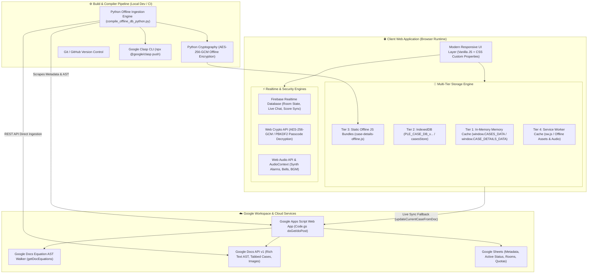
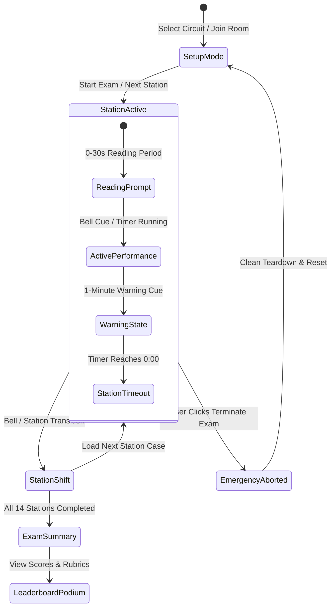
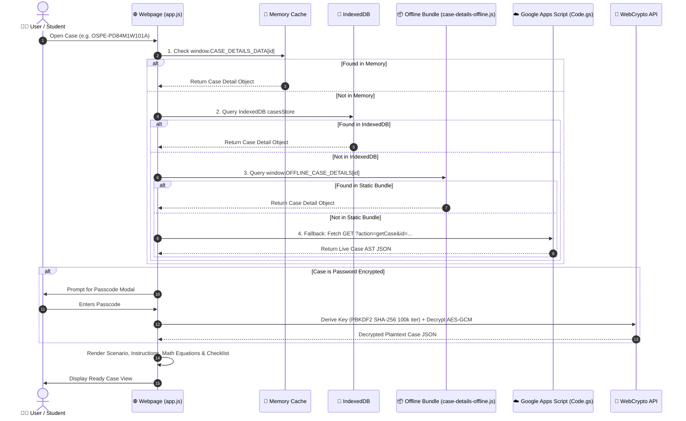
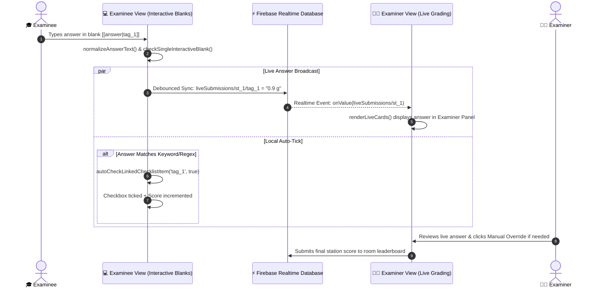

# 🧠 PLE-CC Platform: Master Architecture & Engineering Blueprint
**Version:** 2.0 (Comprehensive Codebase Engineering Reference)  
**Target Systems:** PLE-CC1 (MCQ) & PLE-CC2 (OSPE) Platform  
**Main Repositories:** `c:\Users\thana\Desktop\PLE-CC` & `Website/PLE CC Webpage`  
**Purpose:** Single Source of Truth for system architecture, state machines, algorithmic conditions, and an exhaustive function-by-function reference covering all 440+ functions in the codebase for rapid engineering re-contexting.

---

## 📑 Table of Contents
1. [Executive Architecture & Multi-Tier Topology](#1-executive-architecture--multi-tier-topology)
2. [Global Data Models & TypeScript Interfaces](#2-global-data-models--typescript-interfaces)
3. [Frontend Core Engine Reference (`app.js` — 93 Functions)](#3-frontend-core-engine-reference-appjs)
4. [Backend API & Google Workspace Ingestion (`Code.gs` — 59 Functions)](#4-backend-api--google-workspace-ingestion-codegs)
5. [Python Offline Compiler Pipeline (`compile_offline_db_python.py` — 19 Functions)](#5-python-offline-compiler-pipeline-compile_offline_db_pythonpy)
6. [OSPE Simulation & Real-Time Engine (`exam-simulation.html` — 175 Functions)](#6-ospe-simulation--real-time-engine-exam-simulationhtml)
7. [Specialized Subsystems Reference](#7-specialized-subsystems-reference)
   - [7.1 Video Library Engine (`video-library.html` — 22 Functions)](#71-video-library-engine-video-libraryhtml)
   - [7.2 Handbook PDF Engine (`handbook-library.html` — 18 Functions)](#72-handbook-pdf-engine-handbook-libraryhtml)
   - [7.3 7-Star Room Booking Engine (`booking-room.html` — 51 Functions)](#73-7-star-room-booking-engine-booking-roomhtml)
   - [7.4 Case Library & Tour (`case-library.html`, `mock-story-tour.html` — 3 Functions)](#74-case-library--tour-case-libraryhtml-mock-story-tourhtml)
8. [End-to-End System Sequence Flows (Mermaid Diagrams)](#8-end-to-end-system-sequence-flows)
9. [Critical Business Rules & Algorithmic Conditions](#9-critical-business-rules--algorithmic-conditions)
10. [Troubleshooting Matrix & Engineering Re-Context Playbook](#10-troubleshooting-matrix--engineering-re-context-playbook)

---

## 1. Executive Architecture & Multi-Tier Topology

The PLE-CC system is built with a **Hybrid Offline-First / Cloud-Synchronized Architecture** designed for high reliability during high-stakes OSPE exam simulations, even under unstable network conditions.



---

## 2. Global Data Models & TypeScript Interfaces

### 2.1 Case Metadata Schema (`CaseItem`)
```typescript
interface CaseItem {
  id: string;                    // e.g. "OSPE-CL84M101", "OSPE-PD84M1W101A"
  title: string;                 // Clean title e.g. "Dispensing: Amoxicillin rash"
  category: 'Clinic' | 'Product' | 'Social' | 'General';
  domain: string;                // e.g. "Cardiology", "Infectious Disease", "Pharmaceutics"
  courseGroup: string;           // e.g. "Med Chem", "Pharmacotherapy", "Dosage Form"
  difficulty: 'Easy' | 'Medium' | 'Hard';
  durationMinutes: number;       // Default 4 minutes for standard OSPE stations
  docId: string;                 // Google Docs Source Document ID
  tabName?: string;              // Google Docs Tab Name (if tabbed document)
  tabId?: string;                // Google Docs Tab Unique Resource ID
  hasPassword?: boolean;         // True if AES-256-GCM encrypted
  status: 'Active' | 'Draft' | 'Deprecated';
  scoreMax: number;              // Total rubric/additive score points
}
```

### 2.2 Case Detail Rich Content Schema (`CaseDetail`)
```typescript
interface CaseDetail {
  id: string;
  scenario: string;              // Clean HTML scenario presentation
  patientInfo?: string;          // HTML patient profile, vital signs, lab values
  equipment?: string;            // HTML equipment & formulation ingredients
  instructions: string;          // Specific examinee prompt instructions
  checklist: ChecklistItem[];    // Hierarchical scoring rubric array
  equations?: DocEquationToken[];// Extracted math/chemical equations
  rawHtml?: string;              // Full rich HTML representation
  isEncrypted?: boolean;         // Flag indicating encrypted payload
  encryptedPayload?: {
    salt: string;                // Hex-encoded PBKDF2 salt
    iv: string;                  // Hex-encoded AES-GCM Initialization Vector
    ciphertext: string;          // Hex-encoded encrypted case JSON
    tag: string;                 // Hex-encoded 128-bit authentication tag
  };
}
```

### 2.3 Hierarchical Checklist Item Schema (`ChecklistItem`)
```typescript
interface ChecklistItem {
  id: string;                    // e.g. "chk_1", "chk_1_sub_1"
  text: string;                  // Clean item text description
  rawHtml?: string;              // Rich HTML with <sup>, <sub>, equations
  score: number;                 // Item score weighting (e.g. 0.5, 1, 2)
  isSubset: boolean;             // True if child of a multi-level subset
  subsetLevel?: number;          // Nesting depth: 1 = primary subset, 2 = sub-subset
  subsetType?: 'additive' | 'rubric'; // Additive (sum) vs Rubric (tier/max)
  parentHeaderId?: string;       // ID of parent grouping header
  interactiveTag?: string;       // Blank link tag e.g. "[[blank_1]]"
}
```

---

## 3. Frontend Core Engine Reference (`app.js`)

`Website/PLE CC Webpage/app.js` is the primary client application driver managing auth, offline caching, live sync, checklist evaluation, interactive blank grading, and UI state.

### 3.1 Authentication & Security Engine
| # | Function Signature | Description & Conditions |
|---|---|---|
| 1 | `initAuthGuard()` | Checks `localStorage.getItem('ple_auth_token')`. If missing or invalid, mounts and presents the global authentication modal. |
| 2 | `renderAuthModal()` | Dynamically injects the security lockscreen overlay DOM into `document.body` with input fields and password toggle icons. |
| 3 | `togglePassVisibility()` | Switches `<input type="password">` to `type="text"` and updates eye icon SVG state in the auth modal. |
| 4 | `handleAuthSubmit(e)` | Validates the entered master passcode against client hash/GAS backend. Stores token and unlocks UI on success. |
| 5 | `logoutAuth()` | Purges `ple_auth_token` from `localStorage` and `sessionStorage`, resets runtime state, and re-renders the auth lockscreen. |
| 6 | `addLogoutButton()` | Injects the secure sign-out icon button into the desktop and mobile navigation headers. |
| 7 | `decryptCaseData(encryptedObj, password)` | Uses `window.crypto.subtle` to derive an AES-256-GCM key via PBKDF2 (100,000 iterations of SHA-256) and decrypts the payload. Throws on bad auth tag. |

### 3.2 Offline-First Storage & IndexedDB Subsystem
| # | Function Signature | Description & Conditions |
|---|---|---|
| 8 | `openIndexedDB()` | Initializes or opens `PLE_CASE_DB_v...` with object store `casesStore`. Handles `onupgradeneeded` schema migrations. |
| 9 | `getCasesFromDB(db)` | Asynchronously retrieves all stored case records from IndexedDB using an `IDBTransaction('casesStore', 'readonly')`. |
| 10 | `saveCasesToDB(db, casesObj)` | Bulk inserts or updates case objects in IndexedDB within a readwrite transaction. |
| 11 | `checkAndPurgeStaleCaches()` | Compares `DB_VERSION_STR` against stored version. If mismatched, drops IndexedDB stores and purges localStorage cache to prevent stale data. |
| 12 | `loadOfflineDetailsWithProgress()` | Dynamically evaluates `case-details-offline.js` chunked payload while reporting progress percentages to the splash overlay. |
| 13 | `mergeOfflineDetails()` | Combines static offline case details into `window.CASES_DATA` runtime memory cache. |
| 14 | `injectSplashOverlay()` | Renders the fullscreen startup loading screen with circular progress ring during heavy database hydration. |
| 15 | `updateSplashProgress(pct, received, total)` | Updates the DOM text and CSS width/dasharray of the splash loading bar. |
| 16 | `hideSplashOverlay()` | Fades out and removes the startup splash overlay once IndexedDB hydration completes. |

### 3.3 Data Ingestion, Case Resolution & Live Sync
| # | Function Signature | Description & Conditions |
|---|---|---|
| 17 | `initApiConfig()` | Loads Google Apps Script Web App URL and fallback API endpoints from config or environment constants. |
| 18 | `isCaseActive(c)` | Returns boolean `true` if `c.status === 'Active'` (excludes drafts/unactive cases from student view). |
| 19 | `loadCasesData()` | Master case loader: reads Memory $\rightarrow$ IndexedDB $\rightarrow$ `case-data-offline.js` $\rightarrow$ Live GAS fallback. |
| 20 | `fetchCaseDetail(caseId, forceLive = false)` | Fetches specific case details. If `forceLive === true` or missing offline, issues live `GET ?action=getCase&id=...` to GAS. |
| 21 | `updateCurrentCaseFromDoc()` | Forces a fresh bypass of all caches by calling GAS `getCaseContentViaDocsRestApi`. Re-renders checklist, scenario, and equations immediately. |
| 22 | `onCasesLoaded()` | Lifecycle callback executed once metadata is ready: triggers filter population, badge counters, and default view render. |
| 23 | `forceSyncDatabase()` | User-triggered button action: wipes local database and pulls the latest cases and equations from GAS. |
| 24 | `showGlobalLoader(show, message)` | Displays or hides the global modal spinner with a custom status message. |
| 25 | `showApiStatusBanner(isConnected, message)` | Displays a colored status notification bar indicating cloud connectivity status (Online vs Offline Mode). |

### 3.4 Hierarchical Checklist & Multi-Level Scoring Engine
| # | Function Signature | Description & Conditions |
|---|---|---|
| 26 | `getSubsetGroupType(parentItem, subsetItems)` | Evaluates parent item text. Returns `'rubric'` if text contains `[rubric]` / `เลือกตอบ`, or `'additive'` if text contains `[additive]`. |
| 27 | `resolveChecklistSubsets(checklist)` | Scans checklist array. Parses indentation, bullet levels, and sub-items. Builds nested parent-child tree structures with assigned `subsetLevel`. |
| 28 | `renderChecklist(items, container)` | Recursively generates HTML DOM elements for checklist items, rendering parent headers, additive checkboxes, and rubric radio buttons. |
| 29 | `loadChecklistProgress()` | Reads completed checklist checkbox states from `localStorage` keyed by `ple_chk_progress_{caseId}`. |
| 30 | `saveChecklistProgress()` | Serializes current checked items and persisted score to `localStorage`. |
| 31 | `handleChecklistItemClick(caseId, itemId, itemScore)` | Handles click events on checkboxes/rubric options. Enforces mutual exclusivity on rubric groups and sums additive subsets. |
| 32 | `updateChecklistUI(caseId)` | Recalculates total earned score, updates percentage progress bar, and toggles pass/fail badge (Pass threshold $\ge 80\%$). |

### 3.5 Interactive Blank Inputs & Live Auto-Tick Transceiver
| # | Function Signature | Description & Conditions |
|---|---|---|
| 33 | `renderInteractiveBlanks(htmlOrText, options)` | Scans HTML for `[[answer|tag]]` syntax and replaces them with interactive `<input class="interactive-blank-input">` elements. |
| 34 | `encodeFirebaseKey(k)` | Sanitizes strings for Firebase Realtime DB keys by replacing `.`, `$`, `#`, `[`, `]`, `/` with `%XX` hex codes. |
| 35 | `decodeFirebaseKey(k)` | Decodes sanitized Firebase key strings back to standard characters. |
| 36 | `normalizeAnswerText(str)` | Strips trailing whitespace, removes diacritic variations, and lowercases text for robust fuzzy keyword matching. |
| 37 | `handleInteractiveBlankInput(inputEl)` | Debounced input event listener: captures student keystrokes and broadcasts changes to Firebase and examiner panel. |
| 38 | `checkSingleInteractiveBlank(wrapper)` | Compares current input value against expected key/regex. Applies `.is-correct` or `.is-wrong` CSS styles. |
| 39 | `checkAllInteractiveBlanks()` | Iterates through all interactive blanks on the page, grades each, and displays total correct count. |
| 40 | `autoCheckLinkedChecklistItem(tag, shouldCheck = true)` | Automatically locates the corresponding checklist item matching `tag` and ticks/unticks it based on answer correctness. |

### 3.6 Case Filtering, Search & Dashboard Presentation
| # | Function Signature | Description & Conditions |
|---|---|---|
| 41 | `saveFilterState()` | Saves active search keyword, selected domain, course group, and difficulty filters to `sessionStorage`. |
| 42 | `restoreFilterState()` | Restores previous filter selections from `sessionStorage` upon page navigation. |
| 43 | `resetAllFilters()` | Clears search bar, resets all `<select>` dropdowns to `'All'`, and re-renders full case list. |
| 44 | `applyFilters()` | Filters `window.CASES_DATA` by domain, category, search term, and difficulty. Updates pagination and DOM grid. |
| 45 | `renderFilterSelectOptions()` | Dynamically populates filter dropdowns with unique domains and course groups extracted from active cases. |
| 46 | `renderCaseList()` | Renders case cards into `#casesGrid` with badges for difficulty, duration, status, and completion state. |
| 47 | `updateStatsDashboard()` | Computes total active cases, completed cases, average score, and updates dashboard counter widgets. |

### 3.7 Media Viewer & Lightbox Subsystem
| # | Function Signature | Description & Conditions |
|---|---|---|
| 48 | `openLightbox(src)` | Mounts fullscreen image viewer modal, locks background scroll, and displays high-res case/prescription images. |
| 49 | `closeLightbox()` | Dismisses lightbox modal, resets zoom/pan transforms, and unlocks background scroll. |
| 50 | `zoomLightbox(delta)` | Increments or decrements zoom scale factor ($0.5\times$ to $4.0\times$) with mouse wheel or pinch gestures. |
| 51 | `resetLightboxTransform()` | Resets zoom scale to $1.0\times$ and centers image translation coordinates $(0, 0)$. |
| 52 | `updateLightboxTransform()` | Applies CSS `transform: translate(x, y) scale(s)` to the lightbox image container. |

### 3.8 Batch Print & Export Subsystem
| # | Function Signature | Description & Conditions |
|---|---|---|
| 53 | `openBatchPrintModal()` | Opens batch print configuration dialog for exporting multiple case sheets and checklists simultaneously. |
| 54 | `closeBatchPrintModal()` | Dismisses batch print modal and resets selection checkboxes. |
| 55 | `createBatchPrintModalDOM()` | Dynamically constructs batch print modal DOM elements if not already present in the HTML page. |
| 56 | `populateBatchFilterDropdowns()` | Fills category and domain filters in batch print dialog. |
| 57 | `onBatchCategoryChange()` | Updates available cases in batch selection list when category dropdown changes. |
| 58 | `renderBatchCaseSelectionList()` | Renders selectable case checklist items with select-all toggle. |
| 59 | `toggleBatchCaseSelection(caseId, isChecked)`| Updates internal `Set` of selected case IDs for batch printing. |
| 60 | `selectAllBatchCases(select)` | Selects or deselects all visible cases in the batch selection list. |
| 61 | `updateBatchSelectedCountBadge()` | Updates badge counter indicating total selected cases. |
| 62 | `executeBatchPrint()` | Fetches details for all selected cases, generates continuous printable HTML, and invokes native print dialog. |
| 63 | `triggerNativePrint(orient, scale, mode, printAreaId, onDone)` | Injects `@page` CSS print rules (portrait/landscape, custom margins) and invokes `window.print()`. |

### 3.9 Case Issue Reporting Engine
| # | Function Signature | Description & Conditions |
|---|---|---|
| 64 | `openReportModal(preselectedCaseId)` | Opens bug/error reporting modal with case ID prefilled. |
| 65 | `closeReportModal()` | Clears form inputs and closes report dialog. |
| 66 | `handleReportCaseSearch(event)` | Autocomplete search handler for selecting target case in report modal. |
| 67 | `selectReportCase(caseId, caseTitle)` | Sets selected case ID and title in report form state. |
| 68 | `clearReportCase()` | Clears selected case in report dialog. |
| 69 | `submitCaseReport()` | Submits issue report payload to GAS backend via `POST ?action=submitReport`. |
| 70 | `loadReportHistory()` | Fetches previous issue reports from GAS `getReports` for the current user/admin. |
| 71 | `getReportStatusInfo(status)` | Returns badge color and localized label for report status (`Pending`, `In Review`, `Resolved`). |
| 72 | `renderReportHistory()` | Renders list of submitted reports in the report history accordion. |
| 73 | `setReportFilter(filter)` | Filters report history by status. |
| 74 | `toggleReportHistory()` | Toggles visibility of report history panel. |
| 75 | `updateReportCountBadge()` | Updates unresolved report counter badge on admin header. |
| 76 | `showReportToast(message, isError)` | Displays transient toast notification for report submission success/failure. |

### 3.10 Theme, Audio & Navigation Utilities
| # | Function Signature | Description & Conditions |
|---|---|---|
| 77 | `initTheme()` | Reads theme preference from `localStorage.getItem('ple_theme')` (defaults to system dark/light mode). |
| 78 | `toggleTheme()` | Toggles between `light` and `dark` mode, setting `data-theme` attribute on `<html>`. |
| 79 | `updateThemeButtonIcon(btn)` | Updates sun/moon SVG icon inside theme toggle button. |
| 80 | `initViewToggles()` | Configures grid vs list view toggles on case library pages. |
| 81 | `getSharedAudioContext()` | Returns or initializes a shared singleton `window.AudioContext` after user gesture unlock. |
| 82 | `playStationTimeoutAlarm(type)` | Plays audio alarm cue (`bell`, `alarm`, `warning`) using synthesized oscillators or audio assets. |
| 83 | `initMobileNavigation()` | Sets up touch listeners and hamburger menu controllers for mobile viewports. |
| 84 | `openMobileNav()` | Slides out mobile navigation drawer and dims backdrop. |
| 85 | `closeMobileNav()` | Closes mobile drawer and restores backdrop. |
| 86 | `detectCurrentPage()` | Inspects `window.location.pathname` to determine active page context (`viewer`, `simulation`, `library`). |
| 87 | `getUrlParam(name)` | Helper extracting query string parameters from `window.location.search`. |
| 88 | `escapeHtml(text)` | Sanitizes unsafe HTML characters (`&`, `<`, `>`, `"`, `'`) to prevent XSS. |
| 89 | `safeSetLocalStorage(key, value)` | Safe wrapper around `localStorage.setItem` handling QuotaExceededError exceptions. |
| 90 | `safeFormatScore(num)` | Formats numerical scores (e.g. `2.0` $\rightarrow$ `"2"`, `2.5` $\rightarrow$ `"2.5"`). |
| 91 | `extractYouTubeVideoId(url)` | Regular expression extracting 11-character YouTube video ID from standard or shortened URLs. |
| 92 | `extractGoogleDriveFileId(url)` | Regular expression extracting file ID from Google Drive sharing links. |
| 93 | `renderRichNoteContent(rawHtml)` | Cleans and normalizes Google Docs exported HTML content for rich note display. |

---

## 4. Backend API & Google Workspace Ingestion (`Code.gs`)

`Website/PLE CC Webpage/Code.gs` is the Google Apps Script backend server providing REST endpoints, Google Docs AST parsing, Math equation extraction, room sync, and room booking.

### 4.1 Request Dispatcher & Core Helpers
| # | Function Signature | Description & Conditions |
|---|---|---|
| 1 | `doGet(e)` | Master HTTP GET request router. Dispatches `action` parameter to appropriate controller function. |
| 2 | `buildResponse(data, statusCode = 200)` | Wraps response data in standardized JSON container with CORS headers and timestamp. |
| 3 | `getSpreadsheet()` | Returns active Google Spreadsheet instance defined by `CONFIG.spreadsheetId`. |
| 4 | `escapeHtml(text)` | Server-side HTML entity escaping. |
| 5 | `simpleHash(str)` | Fast integer hash algorithm for caching and checksum validation. |
| 6 | `shuffleArray(arr)` | Fisher-Yates array shuffling algorithm for randomized exam set generation. |
| 7 | `onOpen()` | Google Sheets event hook: creates custom administrative menu bar inside Google Sheets UI. |

### 4.2 Google Docs AST Parsing & Rich Content Extraction
| # | Function Signature | Description & Conditions |
|---|---|---|
| 8 | `getCase(caseId)` | Main case fetcher: locates case row in Sheet, opens source Google Doc, and parses rich content AST. |
| 9 | `getCaseContentViaDocsRestApi(docId, targetCaseId)` | Calls Google Docs REST API v1 directly to obtain raw document structural elements and tabs. |
| 10 | `getAllDocumentTabBodies(doc)` | Traverses all tab objects in a tabbed Google Doc and returns array of tab bodies with tab titles. |
| 11 | `getCaseContentFromDoc(docId, targetCaseId)` | Higher-level document extractor: extracts scenario, patient info, equipment, and checklist from Doc body. |
| 12 | `checkTableTemplate(table, targetCaseId)` | Verifies whether a document table matches the standard 2-column OSPE case template. |
| 13 | `parseTableTemplateToCaseData(table, targetCaseId)` | Deconstructs table rows into Scenario, Instructions, Checklist, and Model Answers. |
| 14 | `parseCellToHtml(cell)` | Converts a Google Docs table cell's paragraph and list elements into clean HTML. |
| 15 | `parseTextElementToHtml(textElement)` | Applies text style properties (colors, sizes, bold, italic, links) to inline text elements. |
| 16 | `parseParagraphToHtml(paragraph)` | Converts paragraph AST elements into `<p>` or list item HTML with preserved formatting. |
| 17 | `parseTableToHtml(table)` | Converts a raw Google Docs table element into a responsive HTML `<table>`. |
| 18 | `applyTs_(ts, txt)` | Converts a Google Docs `TextStyle` object into HTML tags. Preserves `\t` as `&nbsp;&nbsp;&nbsp;&nbsp;`, multiple spaces as `&nbsp;`, and handles `SUPERSCRIPT` (`<sup>`) and `SUBSCRIPT` (`<sub>`). |

### 4.3 Google Docs Equation AST Walker
| # | Function Signature | Description & Conditions |
|---|---|---|
| 19 | `getDocEquations(docId)` | Scans document AST for native `Equation` elements, extracting structured math expressions. |
| 20 | `scanElementForEquationsWithContext_(elem, eqList)` | Recursively traverses container elements, building equation tokens with parent tab/paragraph context. |
| 21 | `renderEquationElementToHtml_(elem)` | Converts Math AST nodes (fractions, roots, superscripts, subscripts) into clean HTML spans (`.equation-fraction`, `.equation-num`, `.equation-denom`). |
| 22 | `formatMathSymbol_(code)` | Maps LaTeX / MathML character entity codes to Unicode math symbols ($\alpha, \beta, \pm, \approx, \ge, \le$). |

### 4.4 Case Indexing, Exam Sets & Sync Management
| # | Function Signature | Description & Conditions |
|---|---|---|
| 23 | `getCaseList(params)` | Queries Case Catalog sheet. Returns filtered array of case metadata with active statuses. |
| 24 | `getCourseGroups(category)` | Returns list of distinct course groups for a given category (`Clinic`, `Product`). |
| 25 | `getSystemStats()` | Aggregates total active cases, category distributions, and domain counts for dashboard widgets. |
| 26 | `generateExamSet(params)` | Generates randomized 14-station OSPE circuit conforming to PLE blueprint category ratios. |
| 27 | `menuSyncCaseLibrary()` | Menu callback: triggers document scanning and catalog synchronization from within Google Sheets. |
| 28 | `syncCaseLibraryFromDocs()` | Batch sync worker: scans registered Google Docs, discovers new cases, and updates metadata sheet. |
| 29 | `scanDocForCases(docId)` | Parses a Google Doc to extract all case headers, IDs, and section boundaries. |
| 30 | `debugCase()` | Diagnostic utility logging raw AST structure for a test case ID to Apps Script execution logs. |
| 31 | `formatSourceName(caseId, rawSource)` | Formats clean human-readable source citations (e.g. "Mock Exam 2568"). |

### 4.5 Real-Time Multi-User Room Management
| # | Function Signature | Description & Conditions |
|---|---|---|
| 32 | `createRoom(params)` | Creates a new exam simulation room record in `Rooms` sheet with random 6-character room code. |
| 33 | `joinRoom(params)` | Adds a participant (Host, Examinee, Examiner, Spectator) to an active room session. |
| 34 | `getRoomStatus(roomId)` | Queries current state of an exam room (current station, timer, pause status, participants). |
| 35 | `getOpenRooms()` | Returns list of publicly joinable active rooms. |
| 36 | `updateRoomStatus(roomId, params)` | Atomically updates room timer, station index, or exam state in the `Rooms` sheet. |
| 37 | `setupRoomSheets()` | Initializes required spreadsheet tabs for room management if not existing. |

### 4.6 Case Issue Reporting Backend
| # | Function Signature | Description & Conditions |
|---|---|---|
| 38 | `setupReportSheet()` | Creates `CaseReports` sheet with columns for ID, Case, Reporter, Description, Status, and Timestamp. |
| 39 | `submitCaseReport(params)` | Appends a new case report row and triggers notification. |
| 40 | `getCaseReports(params)` | Returns filtered list of submitted issue reports. |

### 4.7 7-Star Room Booking & Quota System
| # | Function Signature | Description & Conditions |
|---|---|---|
| 41 | `generateBookingId_()` | Generates unique booking ID string (e.g. `"BK-20261004-ABCD"`). |
| 42 | `generateLogId_(sheet)` | Generates sequential auto-incrementing audit log entry ID. |
| 43 | `_normalizeDateStr(val)` | Standardizes date strings to `YYYY-MM-DD` ISO format. |
| 44 | `_dateStr(d)` | Formats JavaScript `Date` object into `YYYY-MM-DD`. |
| 45 | `getBookingsForWeek(weekStartDate)` | Queries and returns all room bookings falling within a 7-day Monday–Sunday window. |
| 46 | `getDayQuota(date, studentId)` | Checks student's daily booking quota (Maximum 2 hours / 2 slots per day). |
| 47 | `createBooking(payload)` | Validates quota, checks slot conflicts, and records new booking reservation. |
| 48 | `cancelBooking(bookingId, studentId)` | Cancels booking reservation if student ID matches reservation owner. |
| 49 | `autoExpireBookings_()` | Cron worker: automatically marks unconfirmed past bookings as expired. |
| 50 | `checkInBooking(bookingId, studentId)` | Validates QR code or check-in PIN within $\pm 15$ minute check-in window. |

### 4.8 Administrative, Template & Maintenance Utilities
| # | Function Signature | Description & Conditions |
|---|---|---|
| 51 | `setupSheets()` | Master database initialization: creates all required schema tabs with headers and styling. |
| 52 | `decorateHomeBanners(ss)` | Implements Rule 3.5: injects unified "🏠 Return to Home" banner into Row 1 of all spreadsheet tabs. |
| 53 | `updateDocsWithSampleContent()` | Seeds initial sample case templates into demo Google Docs for testing. |
| 54 | `onFormSubmit(e)` | Trigger hook processing Google Form submissions for case authoring. |
| 55 | `fixDocSources(docId, tabId, passcode)` | Administrative utility updating source document links for legacy cases. |
| 56 | `grantClinicEditor(passcode)` | Updates Google Drive sharing permissions to grant editing rights to clinical working group. |
| 57 | `fixClinicCaseStatusTags(passcode)` | Batch normalizes case status tags across clinical case sheets. |
| 58 | `writeOspeTemplateToTargetDoc(targetDocId, tabName, passcode)` | Injects standardized OSPE case authoring template into a designated Google Doc tab. |
| 59 | `testDocTabs()` / `testGetCaseContent()` | Unit test harnesses for verifying document tab extraction and AST parsing. |

---

## 5. Python Offline Compiler Pipeline (`compile_offline_db_python.py`)

`scripts/compile_offline_db_python.py` compiles the entire offline dataset (`case-data-offline.js` and `case-details-offline.js`) directly from Google Workspace, handling live equation scraping, AST normalization, subset resolution, AES-256-GCM encryption, and cache busting.

### 5.1 Compiler Pipeline Functions (19 Functions)
| # | Function Signature | Description & Logic Conditions |
|---|---|---|
| 1 | `main()` | Orchestrates build pipeline: fetches sheets, scrapes docs, downloads equations, encrypts sensitive cases, writes offline JS bundles, and bumps `DB_VERSION_STR`. |
| 2 | `get_all_tab_sections(doc_data)` | Parses Google Docs v1 REST JSON structure across all document tabs, segmenting content into isolated case chunks. |
| 3 | `get_case_content_from_doc(doc_data, target_case_id, doc_equations)` | Locates specific case section within doc data, extracting Scenario, Patient Info, Equipment, Checklist, and matching Equations. |
| 4 | `get_doc_equations_map(doc_id)` | Fetches fresh equation tokens from GAS endpoint `?action=getDocEquations&docId=...`. Writes to `.cache/equations_{doc_id}.json` and falls back to disk cache on error. |
| 5 | `match_tab_equation(elements, el_idx, tab_equations)` | Matches AST equation position with extracted equations list, handling tab-level offsets and fallback tokens. |
| 6 | `format_text_run_to_html(text_run)` | Converts Google Docs `textRun` into HTML. Handles RGB colors, font sizes, styles, `SUPERSCRIPT` (`<sup>`), `SUBSCRIPT` (`<sub>`), `\t` $\rightarrow$ `&nbsp;&nbsp;&nbsp;&nbsp;`, and spaces $\rightarrow$ `&nbsp;`. |
| 7 | `get_image_base64_html(inline_obj_id, inline_objects)` | Downloads inline Google Docs images, caches them to disk (`.cache/images/`), and converts them into optimized base64 data URIs. |
| 8 | `parse_paragraph_to_html(para, inline_objects, lists_dict, tab_equations)` | Transforms paragraph AST element into HTML string with image embedding and equation replacements. |
| 9 | `parse_checklist_item_html(para, inline_objects, tab_equations)` | Specialized checklist text extractor: strips leading numbering/bullet tokens while preserving rich formatting and math spans. |
| 10 | `parse_cell_to_html(cell, inline_objects, lists_dict, tab_equations)` | Deconstructs table cell elements into clean HTML string. |
| 11 | `parse_table_to_html(table, inline_objects, lists_dict, tab_equations)` | Converts document table structures into styled HTML table markup. |
| 12 | `get_cell_text(cell, tab_equations)` | Extracts raw plain text from a table cell for header and keyword matching. |
| 13 | `check_table_template(table, target_case_id)` | Inspects table cell headers to verify if table adheres to OSPE 2-column authoring template. |
| 14 | `parse_table_template_to_case_data(table, target_case_id, inline_objects, lists_dict, tab_equations)` | Extracts scenario, instructions, and checklist directly from a template table structure. |
| 15 | `resolve_checklist_subsets_py(checklist)` | Python implementation of subset resolution: detects bullet indentation and assigns `isSubset`, `subsetLevel`, and `subsetType`. |
| 16 | `wrap_list_items_in_html(html_str)` | Wraps consecutive list item spans in appropriate `<ul>` or `<ol>` tags. |
| 17 | `format_source_name(cid, raw_source)` | Generates clean citation strings for cases based on case ID prefix and source name. |
| 18 | `escape_html(text)` | Escapes special HTML characters in Python. |
| 19 | `simple_hash(s)` | Computes integer hash code matching JavaScript's `simpleHash`. |

---

## 6. OSPE Simulation & Real-Time Engine (`exam-simulation.html`)

`Website/PLE CC Webpage/exam-simulation.html` contains the real-time exam engine supporting both **Single-Player Practice** and **Multi-User Realtime Exam Circuit Mode** (Host, Examiner, Examinee, Spectator).

### 6.1 State Machine & Core Lifecycle


### 6.2 Key Subsystems in `exam-simulation.html` (175 Functions Breakdown)

#### A. Realtime Firebase Synchronization & Live Submissions
- `setupExamineeInteractiveBlanksSync(stationNum, c)`: Establishes debounced 2-way data binding between examinee input fields and Firebase path `/rooms/{roomId}/liveSubmissions/{stationNum}`.
- `setupExaminerLiveSubmissionListener(stationNum, c)`: Real-time listener for examiners: dynamically renders examinee answers in the examiner panel as they are typed.
- `syncToFirebaseNow(payload)`: Broadcasts station changes, timer pauses, and score updates to all room participants.
- `getExamineeSubmissionFirebasePath(stationNum)`: Generates sanitized Firebase path for active station submissions.

#### B. Station Circuit Carousel & Serpentine Flow
- `renderCarouselDiagram(room)`: Generates the Serpentine Circuit visual map displaying station cards, rotation arrows, and student positions.
- `createStationCard(k)`, `createHorizontalArrow(direction)`, `createSpacerCard()`, `createReturnToStationOneBadge()`: DOM generators constructing the 14-station OSPE carousel loop.
- `assignCarouselStation(stationNum, role)`: Maps examinees and examiners to specific stations on the circuit.

#### C. Station Timer, Audio Cues & Synth Alarms
- `tick()`: Core 1-second interval heartbeat: updates remaining time, triggers warning cues at 60s, station shift bells at 0s, and updates circular progress ring.
- `playStationTimeoutAlarm(type, soundOverride)`: Triggers audio cues via `AudioContext` synth or MP3 soundboard.
- `updateRoomAlarmSound(soundKey)`: Sets selected alarm sound for room participants.
- `previewCurrentAlarmSound()`, `stopTimeoutAlarmSound()`, `playFallbackSynthAlarm()`: Audio testing and fallback handlers.

#### D. Emergency Abort & Safe Teardown Engine
- `abortExamSimulation()`: Prompts confirmation modal, cleanly clears `SimState.intervalId`, detaches Firebase listeners, preserves partial scores in `localStorage`, and restores setup UI without browser reloads.
- `resetExamToSetup()`, `restartSetup()`: Resets simulation state variables and returns to room setup view.
- `finishExamSimulation()`: Concludes final station, computes total score, and renders summary podium.

#### E. Station Adjuster & Breakout Room Management
- `openExamSetAdjuster()`, `closeExamSetAdjuster()`, `renderAdjusterStations()`: Drag-and-drop modal allowing hosts to reorder stations, add rest stations, or swap cases.
- `moveStationUp(idx)`, `moveStationDown(idx)`, `removeStationFromAdjuster(idx)`, `addRestStationToAdjuster()`: Station manipulation methods.
- `batchCreateBreakoutTables(totalCount)`, `addBreakoutTable()`, `deleteBreakoutTable(tableId)`: Multi-table breakout room management for large cohort mock exams.

#### F. In-Exam Unified Tool Menu & Resizable Floating Chat
- `toggleStationChatDrawer()`, `toggleMaximizeStationChat()`: Controls chat window visibility and fullscreen expansion.
- `initStationChatDragAndResize()`: Mouse/touch event controller enabling floating chat window dragging and custom resizing.
- `sendStationChatFromInput()`, `sendQuickChatMessage(promptText)`: Message dispatchers broadcasting live messages to the exam room.
- `openScratchpadFromMenu()`, `toggleSimScratchpad()`: Opens virtual notepad for examinee rough calculations.

---

## 7. Specialized Subsystems Reference

### 7.1 Video Library Engine (`video-library.html` — 22 Functions)
Manages clinical skill and compounding video walkthroughs with domain filtering, progress tracking, and theater modal player.
- **Filtering & Data**: `selectDomainFilter()`, `renderDomainSubFilters()`, `setMajorGroup()`, `setDosageForm()`, `resetVideoFilters()`, `applyFilters()`, `renderVideoGrid()`.
- **Progress Tracking**: `getWatchedSet()`, `getFavSet()`, `saveWatchedSet()`, `saveFavSet()`, `toggleCurrentVideoWatched()`, `toggleCurrentVideoFav()`, `updateProgressStats()`.
- **Theater Player**: `openTheaterModal()`, `closeTheaterModal()`, `updateTheaterControls()`, `navigateVideo()`, `toggleTheaterMaximize()`, `toggleTheaterNativeFullscreen()`, `handleTheaterOverlayClick()`, `escapeHtml()`.

### 7.2 Handbook PDF Engine (`handbook-library.html` — 18 Functions)
Integrates PDF.js to provide an interactive clinical reference handbook reader with Table of Contents jump navigation and swipe controls.
- **Rendering & Zoom**: `renderPage()`, `queueRenderPage()`, `prevPage()`, `nextPage()`, `jumpToCustomPage()`, `zoomIn()`, `zoomOut()`, `fitWidth()`, `updateZoomText()`, `showLoading()`.
- **Navigation & TOC**: `selectDocument()`, `renderTOC()`, `updateTOCActiveState()`, `jumpToChapter()`, `toggleTOCCollapse()`, `toggleViewerFullscreen()`, `toggleFullscreen()`, `handleSwipe()`.

### 7.3 7-Star Room Booking Engine (`booking-room.html` — 51 Functions)
Complete mock exam practice room booking system with daily student quotas, PIN cancellations, and QR check-in verification.
- **Calendar & Navigation**: `monOf()`, `dStr()`, `dTH()`, `isToday()`, `isPast()`, `navWeek()`, `navToday()`, `onDatePick()`, `updateLabel()`, `startTick()`.
- **Quota & Availability**: `checkQbAvailability()`, `checkSingleQbQuota()`, `checkSingleQuota()`, `onQbDateTimeChange()`, `onQbSidChange()`, `onSidChange()`.
- **Booking Actions**: `openQuickBook()`, `closeQuickBook()`, `submitQuickBook()`, `openBookModal()`, `closeBook()`, `submitBook()`, `openMyBookings()`, `closeMyBookings()`, `searchMyBookings()`, `renderMyBookingsList()`.
- **Check-In & PIN Cancellation**: `openPinCancelDialog()`, `closePinCancel()`, `submitPinCancel()`, `openCiModal()`, `closeCi()`, `doCiConfirm()`, `doCiCancel()`, `getCiWindow()`, `inCiWin()`, `ciSecsLeft()`, `fmtCd()`.
- **UI & Storage Helpers**: `stGet()`, `stSet()`, `initTheme()`, `applyTheme()`, `toggleTheme()`, `showLoad()`, `refreshData()`, `loadData()`, `drawGrid()`, `onTablePillClick()`, `showTip()`, `moveTip()`, `hideTip()`, `toast()`.

### 7.4 Case Library & Tour (`case-library.html`, `mock-story-tour.html` — 3 Functions)
- `case-library.html`: `toggleFullscreen()`.
- `mock-story-tour.html`: `resizeCanvas()`, `animateParticles()` (HTML5 Canvas animated particle backdrop for orientation).

---

## 8. End-to-End System Sequence Flows

### 8.1 Offline-First Case Loading & Decryption Flow


---

### 8.2 Real-Time OSPE Interactive Blank Auto-Grading & Live Examiner Sync


---

## 9. Critical Business Rules & Algorithmic Conditions

### 9.1 Additive vs Rubric Subset Scoring Logic
In Google Docs, nested checklist items are marked with tags or indentations:
1. **Additive Subsets (`[additive]` or `(additive)`):**
   - Scoring rule: Sum of all checked child items.
   - Example: Parent header (2 points) $\rightarrow$ 4 sub-items worth 0.5 points each. If student completes 3 sub-items, earned score is $3 \times 0.5 = 1.5$ points.
2. **Rubric Tier Subsets (`[rubric]`, `(rubric)`, or `เลือกตอบ`):**
   - Scoring rule: Mutually exclusive radio selection. Earns score of the highest selected tier.
   - Example: Poor (0 pt), Fair (1 pt), Excellent (2 pts). Checking "Excellent" awards 2 points (does not sum with Fair).

### 9.2 Equation Token Replacement & Math Fractions Format
- Native Google Docs equations are converted to structured HTML fractions:
  ```html
  <span class="doc-equation">
    <span class="equation-fraction">
      <span class="equation-num">30 mL</span>
      <span class="equation-denom">100 mL</span>
    </span>
  </span>
  ```
- Any plain text fractions without equations must preserve explicit spacing.

### 9.3 Whitespace, Tab & Columnar Alignment Preservation
- Google Docs tab characters (`\t`) are transformed to `&nbsp;&nbsp;&nbsp;&nbsp;`.
- Consecutive space sequences (` {2,}`) are replaced by non-breaking spaces `&nbsp;` to maintain vertical columnar alignment for mathematical calculations without requiring HTML tables.

### 9.4 Password Cryptography (AES-256-GCM)
- Key derivation: `PBKDF2` with `SHA-256`, 100,000 iterations, 16-byte random salt.
- Cipher: `AES-GCM` with 12-byte IV and 128-bit authentication tag.
- Decryption failure immediately rejects wrong passwords without leaking case contents.

---

## 10. Troubleshooting Matrix & Engineering Re-Context Playbook

| Symptom / Failure Mode | Root Cause Location | Exact Engineering Fix |
|---|---|---|
| **Missing Equations / Blank Spaces** (e.g. `3 g x = 0.9 g`) | Stale `.cache/equations_*.json` in `compile_offline_db_python.py` | Run `python scripts/compile_offline_db_python.py`. The compiler now fetches fresh equations from GAS API before falling back to cache. |
| **Misaligned Calculation Columns** | Whitespace collapsing in HTML renderer | Ensure `format_text_run_to_html` (Python) and `applyTs_` (GAS) convert `\t` $\rightarrow$ `&nbsp;&nbsp;&nbsp;&nbsp;` and ` {2,}` $\rightarrow$ `&nbsp;`. |
| **Subscript / Superscript Lost** (e.g. $C_1V_1$ renders as $C1V1$) | `textStyle.baselineOffset` ignored | Check `applyTs_` in `Code.gs` and `compile_offline_db_python.py` for `SUPERSCRIPT` $\rightarrow$ `<sup>` and `SUBSCRIPT` $\rightarrow$ `<sub>`. |
| **Checklist Sub-items Not Grouping** | Indentation threshold $< 60\text{ pt}$ or missing `[additive]` tag | Check `resolveChecklistSubsets` in `app.js` and `resolve_checklist_subsets_py` in Python compiler. Ensure parent headers contain `ดังต่อไปนี้` or `[additive]`. |
| **Exam Simulation Timer Stuck or Desynced** | Lingering `SimState.intervalId` after rapid restarts | Always call `abortExamSimulation()` or `clearInterval(SimState.intervalId)` before initializing a new exam circuit. |
| **Decryption Failed Error** | Hex encoding mismatch between Python `cryptography` and `window.crypto.subtle` | Ensure Salt (32 hex chars), IV (24 hex chars), and Tag (32 hex chars) are correctly sliced and passed to `crypto.subtle.decrypt`. |
| **Stale Cache on Mobile Devices** | PWA Service Worker caching old JS bundles | Increment `DB_VERSION_STR` in `app.js` and run `compile_offline_db_python.py`. The compiler automatically cache-busts script tags across all HTML files. |

---

*Authored by PLE-CC Engineering Team | RxCU 84-85*
